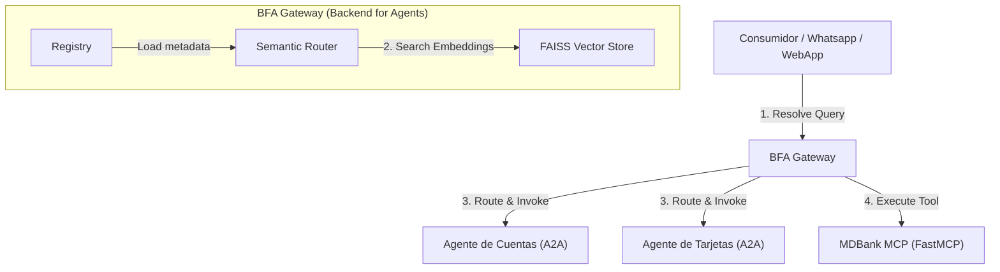

# Backend for Agents SDK (BFA) y Protocolo IRC-A

Un framework y SDK genérico y de diseño estructurado para implementar el patrón **BFA (Backend for Agents)** y el protocolo **IRC-A (Internet Relay Chat for Agents)**, que cuenta con soporte nativo para **Enrutamiento Semántico basado en FAISS (búsqueda vectorial)**, límites de seguridad asimétricos de confianza cero (zero-trust) y abstracciones estándar para Agentes A2A y Servidores MCP.

Lee la especificación oficial del protocolo:
👉 **[Whitepaper del Protocolo IRC-A (v1.0.0)](IRC-A_Whitepaper.md)** - *Redes de Agentes Descentralizadas, Ruteo Semántico de Capacidades y Arquitectura de Software Segura por Diseño.*

---

## Documentación Multilingüe
* [English (Inglés)](README.md)
* [Português (Portugués)](README.pt.md)

---

## Arquitectura del Protocolo BFA / IRC-A

El BFA Gateway actúa como una capa de middleware semántico y bróker de registro entre los canales de consumo (por ejemplo, UIs de mensajería, chats) y los agentes o herramientas especializadas.



---

## Características Clave

1. **Enrutamiento Semántico con FAISS:** En lugar de coincidencia exacta de palabras clave (como BM25), el BFA Gateway indexa las descripciones, tags y ejemplos de agentes y herramientas en un índice vectorial local de FAISS. Esto resuelve consultas incluso usando sinónimos (por ejemplo, asociar *"plástico"* con *"tarjeta de crédito"*).
2. **Abstracción `BFAAgent`:** Simplifica la creación de agentes A2A usando el `a2a-sdk` y Starlette. Obliga a declarar metadatos indispensables (`tags`, `examples`, `description`) requeridos para la indexación semántica.
3. **Abstracción `BFAMCP`:** Envuelve y extiende servidores de `FastMCP`. Expone automáticamente un endpoint estandarizado `/tools` con schemas de entrada, descripciones y tags/ejemplos customizados.
4. **Seguridad IRC-A Segura por Diseño (Roadmap):** Emplea handshakes de registro mediante challenge-response asimétrico, enmascaramiento de canales lógicos (vía variables `.env` de nivel contenedor `IRCA_CHANNELS`) para segregar espacios de búsqueda vectorial, y tokens DET (Delegated Execution Tokens) efímeros para habilitar invocación directa P2P descentralizada sin cuellos de botella en el gateway.
5. **Listo para Serverless (AWS Lambda):** Incluye un adaptador de **Mangum** integrado en el Gateway. Combinado con el driver de nube `OpenAIEmbedder`, el BFA Gateway corre en Lambda bajo demanda con cold-start cero.

---

## Configuración de Proveedores de Embeddings y Chunking

El BFA Gateway utiliza embeddings semánticos para indexar la metadata de agentes y herramientas en FAISS. Se puede seleccionar el proveedor mediante variables de entorno:

| Modo / Proveedor | Variables de Entorno | Dependencias | Descripción |
|---|---|---|---|
| **Local Real (Por defecto)** | Ninguna | `bfa-sdk[local]` | Utiliza `sentence-transformers` de forma local. Recomendado para entornos Python <= 3.12. |
| **OpenAI (Nube)** | `BFA_USE_OPENAI_EMBEDDINGS=true`, `OPENAI_API_KEY="..."` | `openai` | Llama al endpoint `text-embedding-3-small` de OpenAI. Ideal para despliegues serverless (AWS Lambda). |
| **Mock Offline (Feature Hashing)** | `BFA_USE_MOCK_EMBEDDINGS=true` | Ninguna | Utiliza la técnica estable MD5 Feature Hashing para enrutar según coincidencia de palabras clave. Rápido y sin dependencias externas. |

> [!NOTE]
> **¿Por qué no hay Chunking (Fragmentación) en el Gateway?**
> El BFA Gateway actúa como un enrutador semántico de servicios, no como un motor de recuperación documental (RAG). Indexa fichas cortas de metadatos (nombres, descripciones, tags y ejemplos) que caben holgadamente dentro del límite de tokens del embedding.
> Si necesitas realizar **Document Chunking** (RAG sobre PDFs o manuales extensos), este proceso debe ejecutarse **dentro de la base de datos o lógica interna de cada Agente A2A específico**, manteniendo al Gateway desacoplado y ligero.

---

## Instalación y Ejecución de la Demo

### 1. Instalar dependencias
```bash
pip install -r requirements.txt
# Opcional: instalar en modo de desarrollo editable
pip install -e .
```

### 2. Ejecutar la Demo MDBank
La demo inicia tres servidores de simulación en segundo plano:
1. Un servidor MCP MDBank (`examples/mock_mdbank_mcp.py`) en el puerto `8001`.
2. Un agente A2A de Cuentas (`examples/mock_cuentas_agent.py`) en el puerto `8002`.
3. Un agente A2A de Tarjetas (`examples/mock_tarjetas_agent.py`) en el puerto `8003`.
4. El Gateway BFA en el puerto `8000`, realizando el descubrimiento dinámico en red y resolviendo búsquedas semánticas de prueba.

Para ejecutar:
```bash
python examples/run_demo.py
```

### 3. Ejecutar el Panel de Control UI (IRC-A Central Hub)
Hemos incluido un panel visual interactivo desarrollado en React bajo la carpeta `examples/frontend` para monitorear la red de agentes y MCPs activos en tiempo real, registrar dinámicamente nuevos microservicios (plug-and-play) y chatear directamente con los agentes bancarios:

```bash
# Navegar a la carpeta del frontend
cd examples/frontend

# Instalar las dependencias
npm install

# Iniciar el servidor de desarrollo
npm start
```
Abre `http://localhost:3000` en tu navegador para interactuar con tu hub de agentes local en tiempo real.


---

## Créditos y Agradecimientos

Este SDK es una implementación y extensión de código abierto del patrón de arquitectura **BFA (Backend for Agents)** originalmente diseñado y documentado por **Michael Douglas Barbosa Araujo** (Staff AI Architect).

Puedes leer su artículo original introduciendo el patrón aquí:
👉 [O padrão Back-end para Agentes (BFA) - Medium](https://medium.com/@mdbaraujo/o-padr%C3%A3o-back-end-para-agentes-bfa-a53c1c6d87fb)

El objetivo de este proyecto es proveer un SDK modular y estandarizado que extiende su concepto original incorporando soporte para enrutamiento semántico vectorial (FAISS) y adaptadores base unificados. Todo el crédito por el diseño y la visión original de este patrón arquitectónico le pertenece a él.


