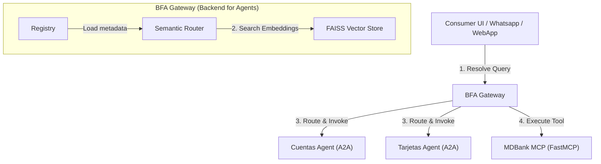

# Backend for Agents SDK (BFA) & IRC-A Protocol

A generic and opinionated framework and SDK to implement the **BFA (Backend for Agents)** pattern and the **IRC-A (Internet Relay Chat for Agents)** protocol, featuring native support for **FAISS-based Semantic Routing (vector search)**, asymmetric zero-trust security boundaries, and standard abstractions for A2A Agents and MCP Servers.

Read the official protocol specification:
👉 **[IRC-A Protocol Whitepaper (v1.0.0)](IRC-A_Whitepaper.md)** - *Decentralized Agent Networks, Semantic Capability Routing, and Secure-by-Design Software Architecture.*

---

## Multilingual Documentation
* [Português (Portuguese)](README.pt.md)
* [Español (Spanish)](README.es.md)

---

## BFA / IRC-A Protocol Architecture

The BFA Gateway acts as a semantic middleware and registry broker layer between consumers (e.g., messaging UIs, chat systems) and specialized agents/tools.



---

## Key Features

1. **FAISS-Based Semantic Routing:** Instead of matching exact keywords (like BM25), the BFA Gateway indexes the descriptions, tags, and examples of agents and tools in a local FAISS vector index. This resolves queries to matching functions even when synonyms are used (e.g., matching *"plastic"* to *"credit card"*).
2. **`BFAAgent` Abstraction:** Simplifies building A2A agents using the `a2a-sdk` and Starlette. Forces standard metadata declarations (`tags`, `examples`, `description`) required for semantic indexing.
3. **`BFAMCP` Abstraction:** Wraps and extends `FastMCP` servers. Automatically exposes a standardized `/tools` endpoint returning input schemas, descriptions, and custom tags/examples for discovery.
4. **Secure-by-Design IRC-A Security (Roadmap):** Employs asymmetric challenge-response registration handshakes, logical channel masking (via container-level `IRCA_CHANNELS` env variables) to segregate vector search spaces, and Ephemeral DET (Delegated Execution Tokens) to enable direct decentralized P2P invocation without gateway bottlenecks.
5. **Serverless (AWS Lambda) Ready:** Includes a built-in **Mangum** adapter in the Gateway. Combined with the cloud-based `OpenAIEmbedder`, the BFA Gateway runs serverless on demand with zero cold-starts.

---

## Configuring Embedding Providers & Chunking

The BFA Gateway uses semantic embeddings to index agent/tool metadata in FAISS. You can choose between local models, cloud APIs, or offline mock routing via environment variables:

| Mode / Provider | Environment Variables | Dependencies | Description |
|---|---|---|---|
| **Local Real (Default)** | None | `bfa-sdk[local]` | Uses `sentence-transformers` locally. Recommended for Python <= 3.12 environments. |
| **OpenAI (Cloud)** | `BFA_USE_OPENAI_EMBEDDINGS=true`, `OPENAI_API_KEY="..."` | `openai` | Queries OpenAI's `text-embedding-3-small` endpoint. Perfect for serverless/Lambda environments. |
| **Offline Mock (Feature Hashing)** | `BFA_USE_MOCK_EMBEDDINGS=true` | None | Uses a stable MD5 feature hashing trick to route queries based on keywords. Zero dependencies, fast, and local. |

> [!NOTE]
> **Why is there no Chunking in the Gateway?**
> The BFA Gateway is a semantic router of services, not a document retrieval engine (RAG). It indexes short microservice metadata cards (names, descriptions, tags, examples) which fit completely within embedding token limits.
> If you need to perform **Document Chunking** (RAG over PDFs/manuals), it should be implemented **inside the respective A2A Agent's internal database/logic**, keeping the Gateway lightweight and decoupled from document storage.

---

## Installation

You can install the BFA SDK directly from GitHub using `pip`:

```bash
# Install the development version from the main branch
pip install git+https://github.com/SandroG1977/bfa-sdk.git

# Or install a specific version with the secure IRC-A protocol support
pip install git+https://github.com/SandroG1977/bfa-sdk.git@feature/docstrings-init
```

---

## Docker Deployment (BFA Gateway Container)

You can run the BFA Gateway (including its semantic search router and dark-mode management dashboard) as a containerized microservice using Docker or Docker Compose.

### Option A: Using Docker Compose (Recommended)
Clone the repository and run the container locally:
```bash
docker-compose up --build -d
```

### Option B: Pulling from Docker Hub
To run the pre-built gateway image directly:
```bash
docker run -d \
  -p 8000:8000 \
  --name bfa-gateway \
  -e OPENAI_API_KEY="your-openai-api-key" \
  sandrog77/irc-a-gateway:latest
```
Access the visual dashboard in your browser at `http://127.0.0.1:8000/`.

---

## Running the Demo

### 2. Run the MDBank Demo
The demo launches three mock servers in the background:
1. A mock MDBank MCP server (`examples/mock_mdbank_mcp.py`) on port `8001`.
2. A mock Cuentas A2A Agent (`examples/mock_cuentas_agent.py`) on port `8002`.
3. A mock Tarjetas A2A Agent (`examples/mock_tarjetas_agent.py`) on port `8003`.
4. The BFA Gateway on port `8000`, running dynamic discovery and performing test queries.

To run:
```bash
python examples/run_demo.py
```

### 3. Run the UI Dashboard (IRC-A Central Hub)
We have included a React-based UI Dashboard under `examples/frontend` to visually monitor the active agents/tools registry, register new microservices dynamically (plug-and-play), and chat with the routed banking agents:

```bash
# Navigate to the frontend folder
cd examples/frontend

# Install dependencies
npm install

# Start the development server
npm start
```
Open `http://localhost:3000` to interact with your local agent hub in real-time.


---

## Credits & Acknowledgements

This SDK is a community-driven implementation and expansion of the **BFA (Backend for Agents)** architectural pattern originally designed and documented by **Michael Douglas Barbosa Araujo** (Staff AI Architect). 

You can read his original article introducing the pattern here:
👉 [O padrão Back-end para Agentes (BFA) - Medium](https://medium.com/@mdbaraujo/o-padr%C3%A3o-back-end-para-agentes-bfa-a53c1c6d87fb)

The goal of this project is to provide a standardized, packaged SDK extending his original concept with semantic vector routing (FAISS) and unified base adapters. All credit for the underlying protocol and architectural vision belongs to him.


