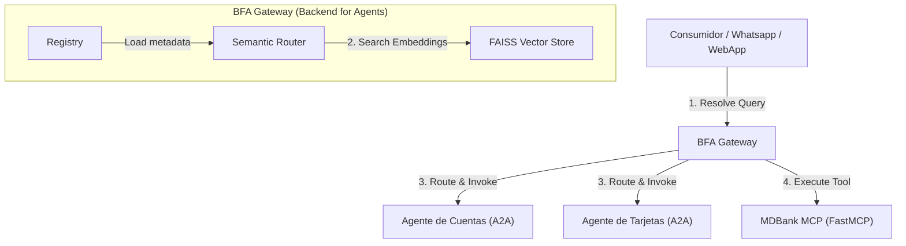

# Backend for Agents SDK (BFA) e Protocolo IRC-A

Um framework e SDK genérico e opinado para implementar o padrão **BFA (Backend for Agents)** e o protocolo **IRC-A (Internet Relay Chat for Agents)**, com suporte nativo a **Roteamento Semântico baseado em FAISS (busca vetorial)**, limites de segurança assimétricos de confiança zero (zero-trust) e abstrações padronizadas para Agentes A2A e Servidores MCP.

Leia a especificação oficial do protocolo:
👉 **[Whitepaper do Protocolo IRC-A (v1.0.0)](IRC-A_Whitepaper.md)** - *Redes de Agentes Descentralizadas, Roteamento Semântico de Capacidades e Arquitetura de Software Segura por Design.*

---

## Documentação Multilíngue
* [English (Inglês)](README.md)
* [Español (Espanhol)](README.es.md)

---

## Arquitetura do Protocolo BFA / IRC-A

O BFA Gateway atua como uma camada de middleware semântico e bróker de registro entre os canais de consumo (ex: UIs de mensagens, sistemas de chat) e agentes ou ferramentas especializadas.



---

## Principais Recursos

1. **Roteamento Semântico baseado em FAISS:** Em vez de fazer correspondência exata de palavras-chave (como o BM25), o BFA Gateway indexa as descrições, tags e exemplos dos agentes e ferramentas em um índice vetorial local FAISS. Isso resolve consultas mesmo quando sinônimos são usados (ex: associar *"plástico"* a *"cartão de crédito"*).
2. **Abstração `BFAAgent`:** Simplifica a criação de agentes A2A usando o `a2a-sdk` e Starlette. Força a declaração de metadatos essenciais (`tags`, `examples`, `description`) exigidos para la indexação vetorial.
3. **Abstração `BFAInteractiveAgent` (NOVO):** Um nó pai especializado para Agentes Frontend ou Coordenadores. Ele gerencia automaticamente um Stack de Memória de Execução por sessão e permite delegar subtarefas a outros agentes da rede via `delegate_task()` usando chaves semânticas limpas, evitando a saturação da rede com históricos de chat extensos.
4. **Abstração `BFAMCP`:** Envolve e estende servidores `FastMCP`. Expõe automaticamente um endpoint padronizado `/tools` contendo schemas de entrada, descrições e tags/exemplos customizados para descoberta.
5. **Segurança IRC-A Segura por Design (Roadmap):** Emprega handshakes de registro usando challenge-response assimétrico, mascaramento de canais lógicos (via variáveis `.env` de nível de contêiner `IRCA_CHANNELS`) para segregar espaços de busca vetorial, e tokens DET (Delegated Execution Tokens) efêmeros para habilitar a invocação direta P2P descentralizada sem gargalos no gateway.
6. **Pronto para Serverless (AWS Lambda):** Inclui um adaptador **Mangum** embutido no Gateway. Combinado com o driver de nuvem `OpenAIEmbedder`, o BFA Gateway roda em Lambda sob demanda com cold-start zero.

---

## Configuração de Provedores de Embeddings e Chunking

O BFA Gateway utiliza embeddings semânticos para indexar a metadata de agentes e ferramentas no FAISS. É possível selecionar o provedor usando variáveis de ambiente:

| Modo / Provedor | Variáveis de Ambiente | Dependências | Descrição |
|---|---|---|---|
| **Local Real (Padrão)** | Nenhuma | `bfa-sdk[local]` | Utiliza `sentence-transformers` de forma local. Recomendado para ambientes Python <= 3.12. |
| **OpenAI (Nuvem)** | `BFA_USE_OPENAI_EMBEDDINGS=true`, `OPENAI_API_KEY="..."` | `openai` | Consulta o endpoint `text-embedding-3-small` da OpenAI. Ideal para implantações serverless (AWS Lambda). |
| **Mock Offline (Feature Hashing)** | `BFA_USE_MOCK_EMBEDDINGS=true` | Nenhuma | Utiliza a técnica estável MD5 Feature Hashing para rotear com base em correspondência de palavras-chave. Rápido e sem dependências externas. |

> [!NOTE]
> **Por que não há Chunking (Fragmentação) no Gateway?**
> O BFA Gateway atua como um roteador semântico de serviços, não como um motor de busca documental (RAG). Ele indexa fichas curtas de metadatos (nomes, descrições, tags e exemplos) que cabem perfeitamente dentro do limite de tokens do embedding.
> Se você precisar de **Document Chunking** (RAG sobre PDFs ou manuais extensos), esse processo deve ser executado **dentro do banco de dados ou lógica interna de cada Agente A2A específico**, mantendo o Gateway leve e desacoplado.

---

## Instalação

Você pode instalar o SDK do BFA/IRC-A diretamente do GitHub usando o `pip`:

```bash
# Instalar a biblioteca a partir do branch principal (main)
pip install git+https://github.com/SandroG1977/bfa-sdk.git
```

Depois de instalado, você pode iniciar o Gateway diretamente do terminal usando o executável CLI embutido:

```bash
# Iniciar o servidor do IRC-A Gateway
irc-a-gateway
```

---

## Implantação com Docker (Contêiner do Gateway BFA)

Você pode executar o Gateway BFA (incluindo seu roteador de busca semântica vetorial e o painel de controle interativo em modo escuro) como um microsserviço conteinerizado usando o Docker ou Docker Compose.

### Opção A: Usando Docker Compose (Recomendado)
Clone o repositório e inicie o contêiner localmente:
```bash
docker-compose up --build -d
```

### Opção B: Baixar do Docker Hub
Para executar a imagem pré-compilada do Gateway diretamente:
```bash
docker run -d \
  -p 8000:8000 \
  --name bfa-gateway \
  -e OPENAI_API_KEY="sua-openai-api-key" \
  sandrog77/irc-a-gateway:latest
```
Acesse o painel visual no seu navegador em `http://127.0.0.1:8000/`.

### Conectando Agentes e Servidores MCP Remotos

Assim que o contêiner do seu Gateway estiver rodando em um servidor (por exemplo, em `http://IP_DO_SEU_SERVIDOR:8000`), você poderá conectar dinamicamente agentes e ferramentas de qualquer local.

#### 1. Auto-registro Automático (Recomendado)
Configure seu agente ao instanciar `BFAAgent` informando a URL do Gateway do servidor:
```python
agent = MeuAgente(
    agent_id="meu-agent-id",
    name="Meu Agente",
    url="http://IP_LOCAL_DO_SEU_AGENTE:8080",
    gateway_url="http://IP_DO_SEU_SERVIDOR:8000"
)
```
Ao iniciar, o agente realizará automaticamente o handshake criprográfico e se registrará no índice FAISS do Gateway remoto.

#### 2. Registro Manual (cURL)
Você pode registrar manualmente qualquer agente ou servidor MCP enviando uma requisição HTTP:

* **Registrar um Agente:**
  ```bash
  curl -X POST "http://IP_DO_SEU_SERVIDOR:8000/register/agent?url=http://IP_DO_SEU_AGENTE:PORTA&channels=#public"
  ```
* **Registrar um Servidor MCP:**
  ```bash
  curl -X POST "http://IP_DO_SEU_SERVIDOR:8000/register/mcp?url=http://IP_DO_SEU_MCP:PORTA&channels=#public"
  ```

Uma vez registrado, as novas capacidades estarão disponíveis imediatamente para buscas e roteamento semântico através do gateway.

---

## Execução do Demo

### 2. Rodar a Demonstração do MDBank
A demonstração inicia três servidores de simulação em segundo plano:
1. Um servidor MCP MDBank (`examples/mock_mdbank_mcp.py`) na porta `8001`.
2. Um agente A2A de Cuentas (`examples/mock_cuentas_agent.py`) na porta `8002`.
3. Um agente A2A de Tarjetas (`examples/mock_tarjetas_agent.py`) na porta `8003`.
4. O Gateway BFA na porta `8000`, realizando a descoberta em tempo real e resolvendo buscas semânticas de teste.

Para rodar:
```bash
python examples/run_demo.py
```

### 3. Rodar o Painel de Controle UI (IRC-A Central Hub)
Incluímos um painel visual construído em React na pasta `examples/frontend` para monitorar a rede de agentes/mcp ativos, registrar dinamicamente novos microserviços (plug-and-play) e conversar diretamente com os agentes do banco:

```bash
# Navegar até a pasta do frontend
cd examples/frontend

# Instalar as dependências
npm install

# Iniciar o servidor de desenvolvimento
npm start
```
Abra `http://localhost:3000` no seu navegador para interagir com o seu hub de agentes local em tempo real.


---

## Créditos e Agradecimentos

Este SDK é uma implementação e extensão de código aberto do padrão de arquitetura **BFA (Backend for Agents)** originalmente idealizado e documentado por **Michael Douglas Barbosa Araujo** (Staff AI Architect).

Você pode ler o artigo original dele introduzindo o padrão aqui:
👉 [O padrão Back-end para Agentes (BFA) - Medium](https://medium.com/@mdbaraujo/o-padr%C3%A3o-back-end-para-agentes-bfa-a53c1c6d87fb)

O objetivo deste projeto é disponibilizar um SDK padronizado e modular, estendendo o conceito original dele com suporte a roteamento semântico vetorial (FAISS) e adaptadores base unificados. Todos os créditos pelo padrão arquitetônico fundamental pertencem a ele.


