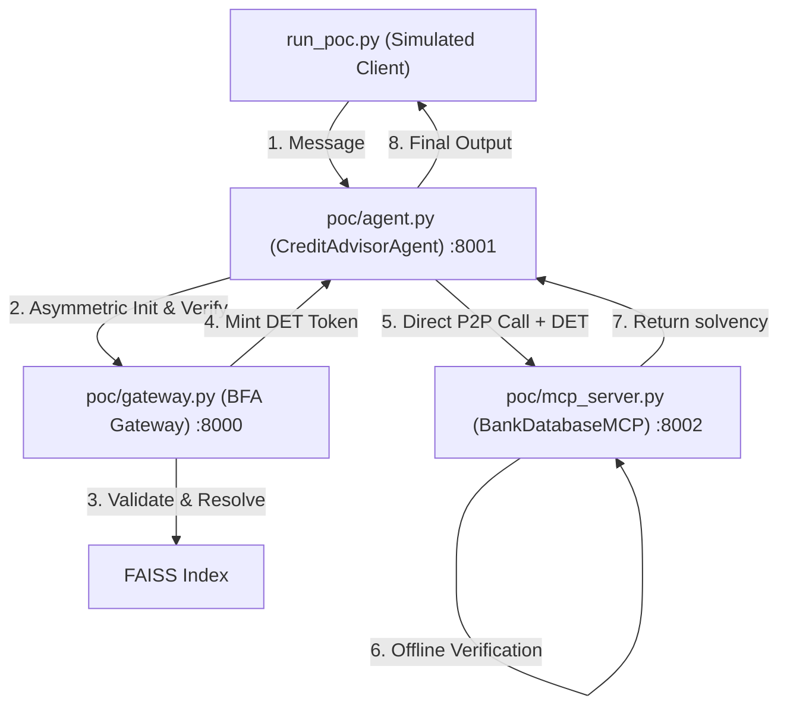

# BFA / IRC-A Security Proof of Concept (POC)

This folder contains a fully functional, self-contained Proof of Concept (POC) demonstrating the **IRC-A (Internet Relay Chat for Agents)** security protocol and semantic routing mechanics of the Backend for Agents (BFA) SDK.

---

## 🏗️ Architecture



The POC consists of three live servers running on separate ports:
1. **BFA Gateway (`gateway.py`)** running on port `8000`.
2. **CreditAdvisorAgent (`agent.py`)** running on port `8001` (representing an A2A agent).
3. **BankDatabaseMCP (`mcp_server.py`)** running on port `8002` (representing a secure tool provider).

---

## 🎯 Simulated Flows

When you run the orchestrator, it runs through four critical verification stages:

### Flow 1: Semantic Index & Registration Check
* Verifies that the agent and MCP servers successfully execute their asymmetric RSA challenge-response handshake with the Gateway on startup.
* Validates that logical channel filtering works: matches queries dynamically within the `#finance` logical scope.

### Flow 2: End-to-End P2P Invocation with signed DET
* The client asks the Agent: `"calculate solvency rating for customer 722"`.
* The Agent fetches a **Delegated Execution Token (DET)** from the Gateway.
* The Agent invokes the MCP tool directly (P2P).
* The MCP tool validates the signature and parameters offline, returning the correct database entry.

### Flow 3: Parameter Lockdown Block (Zero-Trust)
* The client attempts to request rating for customer `722` but tells the agent to bypass and request customer `999` from the database.
* The Agent fetches a DET for customer `722` but sends `customer_id=999` to the tool.
* The MCP tool intercepts the call and **rejects** it because the parameter value (`999`) does not match the token's locked-down constraint (`722`).

### Flow 4: Infinite Loop Mitigation
* The client sends a request to the Agent injecting `"credit-advisor-agent"` in the `X-Visited-Nodes` header.
* The SDK loop-detection middleware blocks the execution instantly, returning a `409 Conflict` response to prevent recursive calling loops.

---

## 🚀 How to Run

From the root directory of the repository, execute:

```bash
.venv/bin/python poc/run_poc.py
```
